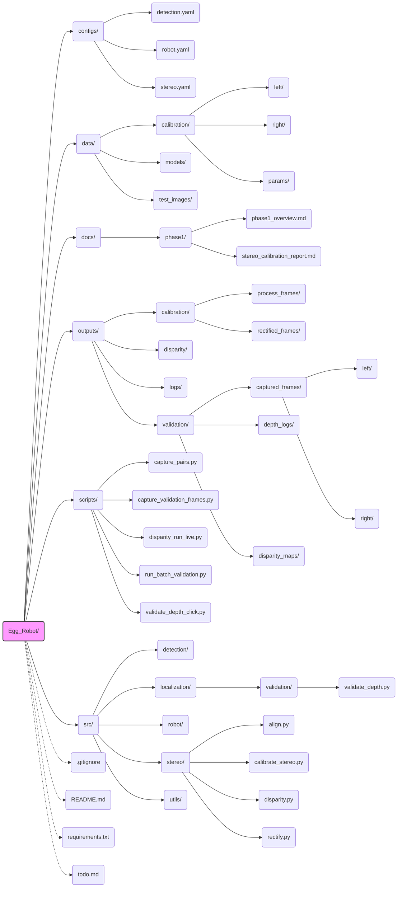

```mermaid
graph LR
    %% Root node
    Root("Egg_Robot/")
    style Root fill:#f9f,stroke:#333,stroke-width:2px;

    %% Base directories and root files
    Root --> configs("configs/")
    Root --> data("data/")
    Root --> docs("docs/")
    Root --> outputs("outputs/")
    Root --> scripts("scripts/")
    Root --> src("src/")
    Root -.-> gitignore(".gitignore")
    Root -.-> readme("README.md")
    Root -.-> reqs("requirements.txt")
    Root -.-> todo("todo.md")

    %% --- CONFIGS ---
    configs --> c_det("detection.yaml")
    configs --> c_rob("robot.yaml")
    configs --> c_ste("stereo.yaml")

    %% --- DATA ---
    data --> d_calib("calibration/")
    data --> d_models("models/")
    data --> d_test("test_images/")
    d_calib --> d_c_l("left/")
    d_calib --> d_c_r("right/")
    d_calib --> d_c_p("params/")

    %% --- DOCS ---
    docs --> do_ph1("phase1/")
    do_ph1 --> do_p_o("phase1_overview.md")
    do_ph1 --> do_p_r("stereo_calibration_report.md")

    %% --- OUTPUTS ---
    outputs --> o_calib("calibration/")
    outputs --> o_disp("disparity/")
    outputs --> o_logs("logs/")
    outputs --> o_val("validation/")
    o_calib --> o_c_p("process_frames/")
    o_calib --> o_c_r("rectified_frames/")
    o_val --> o_v_cap("captured_frames/")
    o_val --> o_v_dep("depth_logs/")
    o_val --> o_v_disp("disparity_maps/")
    o_v_cap --> o_v_c_l("left/")
    o_v_cap --> o_v_c_r("right/")

    %% --- SCRIPTS ---
    scripts --> sc_cap("capture_pairs.py")
    scripts --> sc_cval("capture_validation_frames.py")
    scripts --> sc_disp("disparity_run_live.py")
    scripts --> sc_rval("run_batch_validation.py")
    scripts --> sc_vdep("validate_depth_click.py")

    %% --- SRC ---
    src --> sr_det("detection/")
    src --> sr_loc("localization/")
    src --> sr_rob("robot/")
    src --> sr_ste("stereo/")
    src --> sr_uti("utils/")
    sr_loc --> sr_l_v("validation/")
    sr_l_v --> sr_l_v_v("validate_depth.py")
    sr_ste --> sr_s_ali("align.py")
    sr_ste --> sr_s_cal("calibrate_stereo.py")
    sr_ste --> sr_s_dis("disparity.py")
    sr_ste --> sr_s_rec("rectify.py")
```
